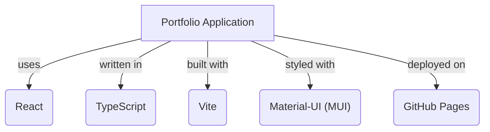

# Developer Portfolio Template

A clean, responsive developer portfolio built with React, TypeScript, and Material-UI.

## How to Use

1.  **Clone this repository.**
2.  **Install dependencies:** `npm install`
3.  **Customize Configuration:**
    *   Open `src/utils.ts` and update `BASE_URL` to match your repository name (e.g., `/My-Portfolio`).
    *   Open `vite.config.ts` and update `base` to match `BASE_URL`.
    *   Open `package.json` and update the `homepage` URL.
4.  **Add Your Data:**
    *   Edit `src/data.ts` to add your projects and bio.
    *   Update `src/components/AboutMe.tsx` and `src/components/Header.tsx` with your social links.
5.  **Add Your Assets:**
    *   Add your resume to `public/files/` (e.g., `Resume.pdf`).
    *   Add project images and your profile picture to `public/images/`.
    *   **Important:** Update `src/components/AboutMe.tsx` and `src/index.tsx` to reference your specific profile picture filename (e.g., `Profile.png`).
    *   **Important:** Update `src/components/AboutMe.tsx` to reference your specific resume filename.
6.  **Screen Recordings (Optional):**
    *   This repository uses Git LFS for `.mp4` files. If you add screen recordings to the `screen recordings/` directory, ensure you have Git LFS installed (`git lfs install`).

## Features

*   **Dynamic Project Showcase:** Projects are loaded from a centralized data source.
*   **Technology Filtering:** Users can filter the projects by specific technologies.
*   **Detailed Project View:** Each project has a dedicated page with an in-depth description.
*   **Project Status Overview:** A visual progress bar shows the current development phase.
*   **Responsive Design:** Fully responsive and designed for all devices.
*   **Modern UI/UX:** Built with Material-UI.

## Tech Stack

*   **Core Framework:** React
*   **Language:** TypeScript
*   **Build Tool:** Vite
*   **UI Library:** Material-UI (MUI)
*   **Deployment:** GitHub Pages

## Available Scripts

*   `npm run dev`: Starts the Vite development server.
*   `npm run build`: Compiles and bundles the application for production.
*   `npm run deploy`: Deploys to GitHub Pages.
