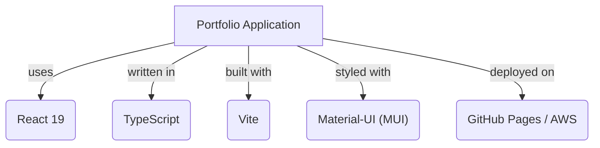

# Developer Portfolio Template

A clean, responsive developer portfolio built with React 19, TypeScript, and Material-UI.

## How to Use

1.  **Clone this repository.**
2.  **Install dependencies:** `pnpm install`
3.  **Customize Configuration:**
    *   Open `src/utils.ts` and update `BASE_URL` to match your repository name (e.g., `/My-Portfolio`).
    *   Open `vite.config.ts` and update `base` to match `BASE_URL`.
    *   Open `package.json` and update the `homepage` URL.
4.  **Add Your Data:**
    *   Edit `src/data.ts` to add your projects, bio, and tech stack frequencies.
    *   Update `src/data.ts` with your social links (GitHub, LinkedIn, etc.).
5.  **Add Your Assets:**
    *   Add your resume to `public/files/` (e.g., `Resume.pdf`).
    *   Add project images and your profile picture to `public/images/`.
    *   **Important:** Update `src/components/AboutMe.tsx` and `src/index.tsx` to reference your specific profile picture filename (e.g., `Profile.png`).
6.  **Screen Recordings (Optional):**
    *   This repository uses Git LFS for `.mp4` files. If you add screen recordings to the `screen recordings/` directory, ensure you have Git LFS installed (`git lfs install`).

## Features

*   **Dynamic Project Showcase:** Projects are loaded from a centralized data source.
*   **Technology Filtering:** Users can filter the projects by specific technologies.
*   **Detailed Project View:** Each project has a dedicated page with an in-depth description, image galleries, and optional **header images**.
*   **Project Status Overview & SDLC:** A visual progress bar and charts show the current development phase.
*   **ClickUp Integration (Optional):** Track live project tasks by providing a `clickupListId` and running the included fetch script.
*   **Responsive Design:** Fully responsive and designed for all devices.
*   **Modern UI/UX:** Built with Material-UI and features glassmorphism and smooth animations.

## Tech Stack

*   **Core Framework:** React 19
*   **Language:** TypeScript
*   **Build Tool:** Vite
*   **UI Library:** Material-UI (MUI 5)
*   **Charts:** React-Plotly.js
*   **Deployment:** GitHub Pages / AWS (Terraform)

## Deployment Options

### 1. GitHub Pages (Quick & Easy)
Use the included npm scripts to deploy directly to GitHub Pages.
*   `pnpm run deploy`: Deploys the `dist` folder to the `gh-pages` branch.

### 2. AWS via Terraform (Production Ready)
For advanced hosting, an `infra/` folder is included with Terraform configuration for hosting the static site on AWS S3 with CloudFront.
*   Configure your AWS credentials.
*   Navigate to `infra/`, update `variables.tf` with your domain, and run `terraform init` and `terraform apply`.

## Available Scripts

*   `pnpm run dev`: Starts the Vite development server.
*   `pnpm run build`: Compiles and bundles the application for production.
*   `pnpm run deploy`: Deploys to GitHub Pages.
*   `pnpm run preview`: Previews the production build locally.
